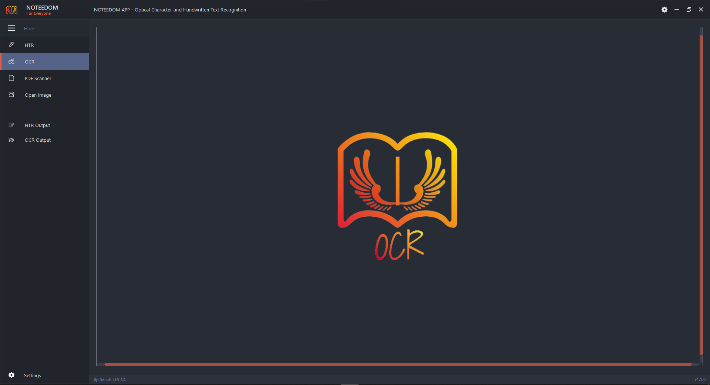
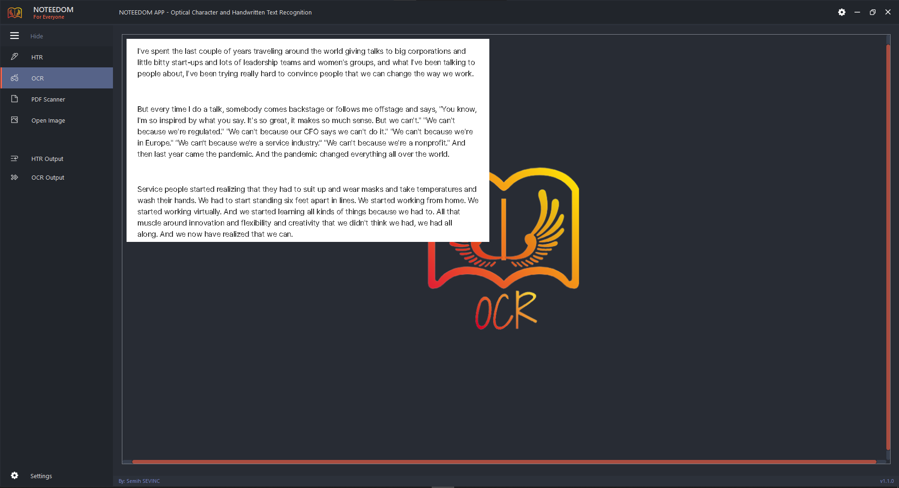
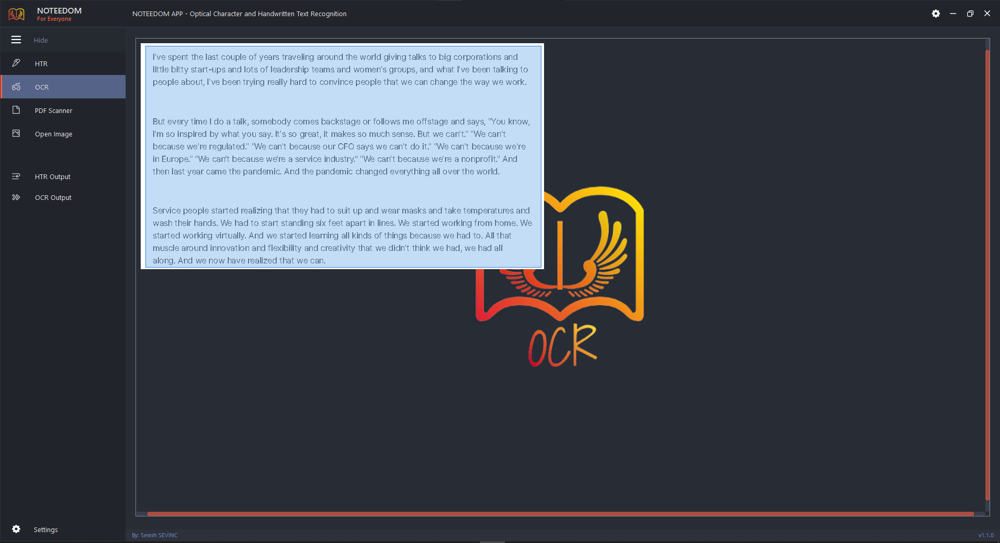
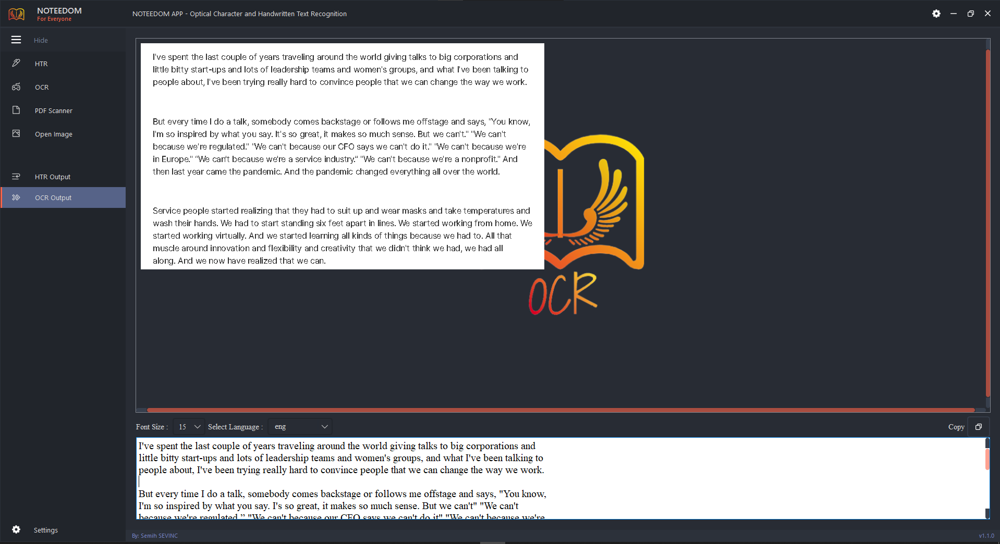
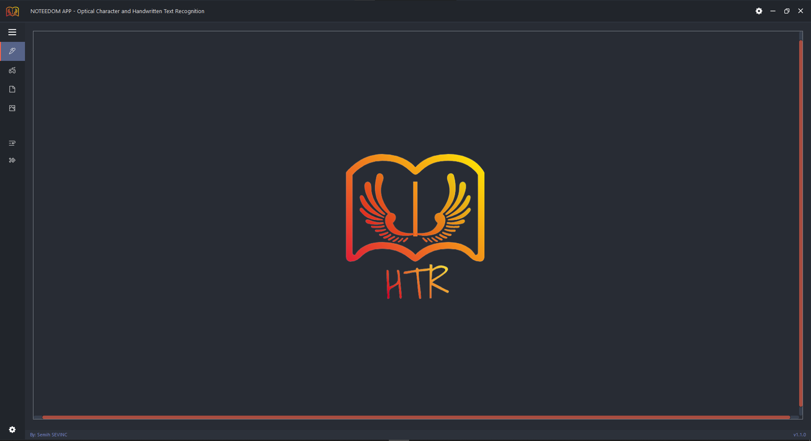
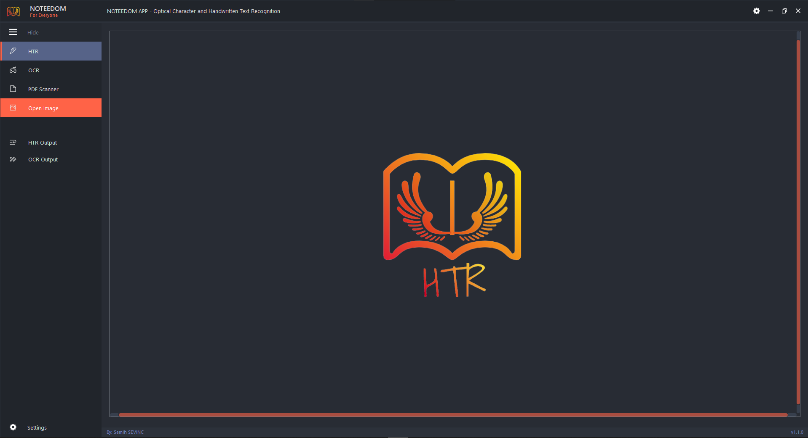
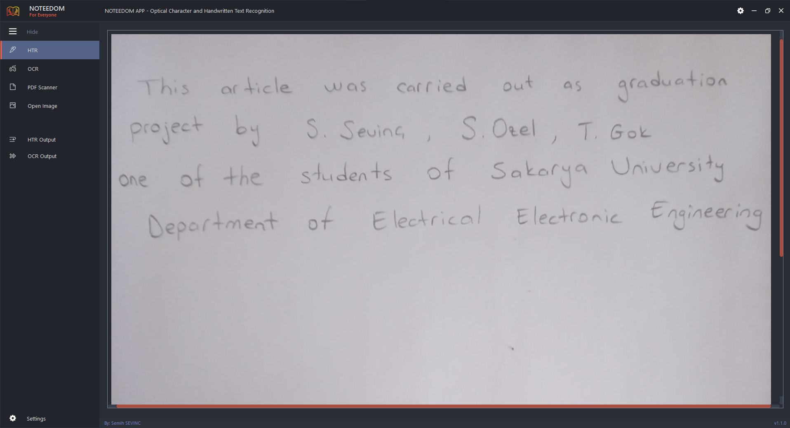
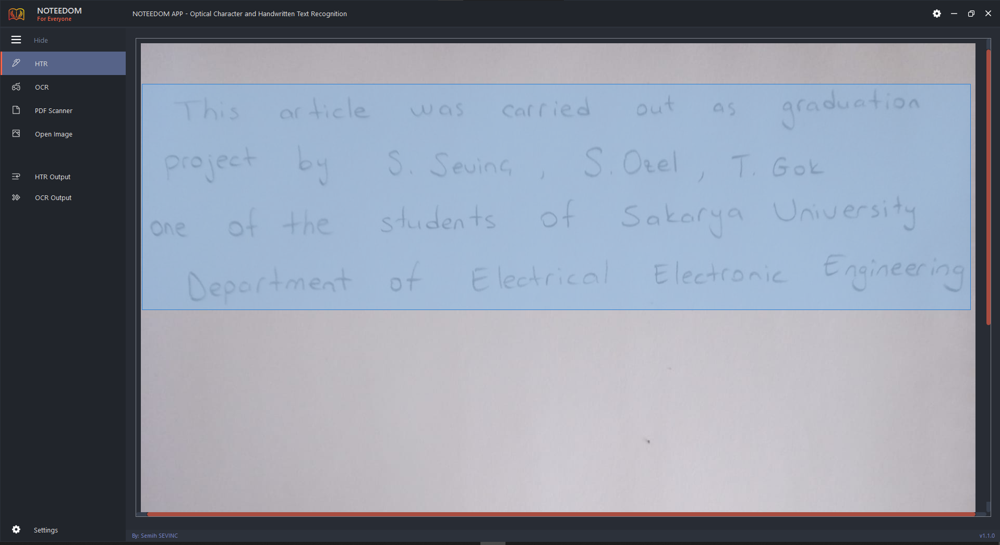
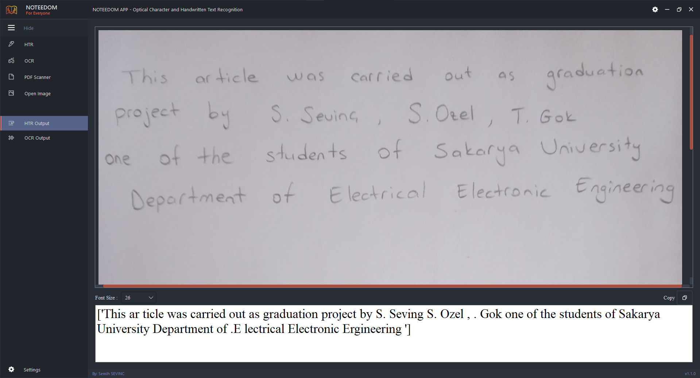

  

<h2 align="center">
NOTEEDOM APP - Optical Character and Handwritten Text Recognition
</h2>

<h3 align="center">
The basis of this application was created in Sakarya University Electrical Electronics Engineering Graduation Project. The final purpose of the application is to convert the handwritten image to optical writing (HTR). Also optical character recognition(OCR) can also be performed using Google Tesseract.
</h3> 
<h3 align="left">
To Open the Noteedom Application
</h3>
Clone This Repository 
Run noteedom.py 

<h2 align="center">
OCR
</h2>
These software, called 'Optical Character Recognition', are developed to transfer text contained in a scanned document, photo to a computer environment. Under normal conditions, graphic files transferred to the computer via a browser are detected by the computer as images. The text in this graphic file can be analyzed by OCR software and converted to a text file. The text will be transferred to the computer without the need to use a keyboard. The data that is texted with OCR is the data that can be edited. Although the error rate of OCR software is not zero, its use has become quite common today. When it is called a program for converting a photo to text, what is meant is OCR software. In this application, Google Tesseract has been used for this operation.
<h3 align="left">

To use OCR, you need to:
</h3>
You should select the image you want to convert by clicking the 'Open Image' button located in the left menu bar. 
Then you will see that the image is transferred to the OCR tab. 

After that, all you need to do is scan with the mouse to include the text you want to convert. 

You can see the result in the window that opens by clicking on the 'OCR Results' button located in the lower-left menu bar. 

(Make sure that you are on the OCR tab when performing these operations, and thanks to Google Tesseract, you can select the desired language option in the window that opens by clicking on the 'OCR Results' button) 
<h2 align="center">
HTR
</h2>
HTR technology is the process of converting user-specific handwriting into optical characters using an algorithm trained with a lot of data. In this application, you can convert your handwritten images into optical characters.

<h3 align="left">
To use HTR, you need to:
</h3>
You should select the image you want to convert by clicking the 'Open Image' button located in the left menu bar. 

Then you will see that the image is transferred to the HTR tab. 

After that, all you need to do is scan with the mouse to include the text you want to convert. 

You can see the result in the window that opens by clicking on the ‘HTR Results’ button located in the lower-left menu bar. 

(Make sure that you are on the HTR tab when performing these operations, and note that the HTR operation works only for English) 

<h2 align="center">
PDF Scanner
</h2>
<h3 align="left">
Not Able to Use (Will Operate Soon)</h3>

